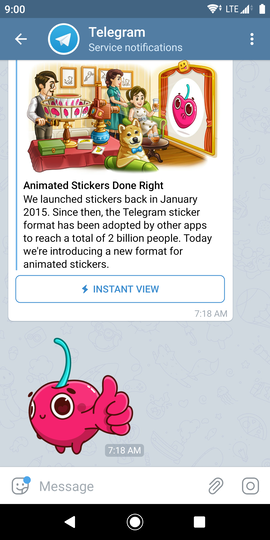

This morning, Telegram added support for animated stickers:



Animated stickers can already be found in other messaging apps like WeChat or Line, but Telegram's
annoucement was not claiming that they were the first to introduce animated stickers---instead, it's
putting forward a new file format for animated stickers.

## A closer look

Interesting, let's download the example sticker sent by the app and take a closer look:
<div style="text-align: center;">
  <video autoplay loop title="Screenshot of the release announcement in the Telegram app together with an animated sticker">
    <source src="announcement.mp4" type="video/mp4">
    
  </video>
</div>

First off, how much space does it take up really?

```console
$ ls -lh animated-sticker.tgs 
-rw-------@ 1 yijiayu  staff    15K Jul  7 20:01 animated-sticker.tgs
```

Wow, only 15 KB? It's actually even smaller than this static cat in a cup sticker from the
[CafeNyanbyTikelku](https://t.me/addstickers/CafeNyanbyTikelku) sticker pack, which weighs in at 19
KB:



```console
$ ls -lh sticker.webp 
-rw-------@ 1 yijiayu  staff    19K Jul  7 20:24 sticker.webp
```

Is TGS actually some existing format in disguise?

```console
$ file animated-sticker.tgs 
animated-sticker.tgs: gzip compressed data, max compression, from Unix, original size 109754
```

Oh, it's GZIP compressed? What will we get if we uncompress it?

```console
$ gzip -dc animated-sticker.tgs > animated-sticker
$ file animated-sticker
animated-sticker: ASCII text, with very long lines, with no line terminators
```

It's actually a text file! What does it contain?

```console
$ head -c 200 animated-sticker
{"tgs":1,"v":"5.5.2","fr":60,"ip":0,"op":180,"w":512,"h":512,"nm":"C-07","ddd":0,"assets":[],"comps":[],"layers":[{"ddd":0,"ind":1,"ty":3,"nm":"master","sr":1,"ks":{"o":{"a":0,"k":0},"r":{"a":0,"k":0}
```

JSON!!!

## So what exactly are TGS files?

Let's go back to the release annoucement for a moment:

> Telegram engineers experimented with vector graphics, packaging methods and forbidden magic to create the Lottie-based .TGS format, in which each sticker takes up about 20-30 Kilobytes – six times smaller than the average photo.

### Lottie

When I first read the release announcement, I thought Lottie was some kind of new compression
algorithm like Brotli or AV1. Some quick research reveals that it's actually an Airbnb-developed
library which renders Adobe After Effects animations exported in JSON format:



So that's why the TGS file contained JSON data!

## Thoughts about Telegram animated stickers

### Higher barriers to entry

When Telegram introduced [custom sticker sets](https://telegram.org/blog/stickers-revolution), the
ease of creating your own sticker pack was a big deal. Anyone could just strike up a conversation
with the [@stickers](https://telegram.me/stickers) bot, send it a photo and you would get a link to
your very own sticker pack.

However, at the moment there's a higher barrier to entry for animated stickers---Adobe After Effects
itself already costs more than SGD$25 a month, or nearly SGD$300 for a prepaid annual subscription.
I think it's unlikely that we'll be creating animated stickers of our classmates, friends or
colleagues for fun in the near future.

On the other hand, animated GIFs---which Telegram has supported for a long time---already meet the
abovementioned use case, so there's no real need for the average Telegram user to create their own
animated stickers anyway.

### Less support for open standards

I initially had reservations about Telegram's introduction of its own original file format
([obligatory XKCD about standards](https://xkcd.com/927/)). In the past, Telegram has also drawn
criticism for its creation of its own cryptographic protocol which it uses to secure its messages.
Given that static Telegram stickers are already being served using
[WebP](https://developers.google.com/speed/webp/), an existing image format, I had thought that it
would be natural to do the same for animated stickers (it's true that WebP is not as widely adopted
itself though).

Encouragingly, Airbnb's Lottie, which Telegram's animated stickers are based on, does seem to have
some momentum. At least one site, [LottieFiles](https://lottiefiles.com/), touts itself as "The
Future of Animations and Interactive Design". Perhaps in the future, tooling to make working with
TGS files easier will exist. Perhaps even interoperability with the existing Lottie ecosystem will
be possible.



## Conclusion

As usual, I'm not actually going to make any concrete statements, but in my opinion, animated
stickers are pretty gimmicky right now. Nevertheless, Telegram is undoubtedly an influential
platform on its own, and is bullish on the future of animated stickers themselves:

> Like its static predecessor, the Telegram animated sticker format is likely to become the new industry standard in messaging.

---

PS. Amusingly, the animations on the release announcement are just MP4 videos, but admittedly
they're announcing a new feature for their own platform, not the web.
